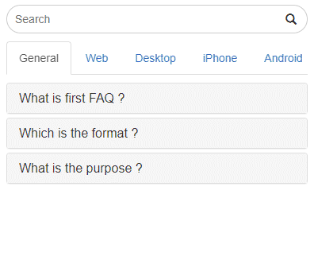

# nodejs-accordion-faq-with-searchbar
  

**Node.js accordion FAQ with Searchbar**



- The node.js app use ejs template package.
- FAQ accordion with Searchbar.
- Mobile responsive template.
- include bootstrap.

## external json example
``` javascript
// use request promise package

const rp = require("request-promise");
app.get('/', function (req, res) {
    return rp({
        method: "GET",
        url: 'http://<yourdomain>/faq.json'
    }).then(body => {
        var faqInfo = JSON.parse(body);
        faqInfo.sort(function (a, b) {
            return a["index"] - b["index"];
        });
        res.render("faq", {
            faqInfo: faqInfo
        });
    }).catch(e => {
        console.log(e.message);
        res.status(400).send('');
    });
});
```
